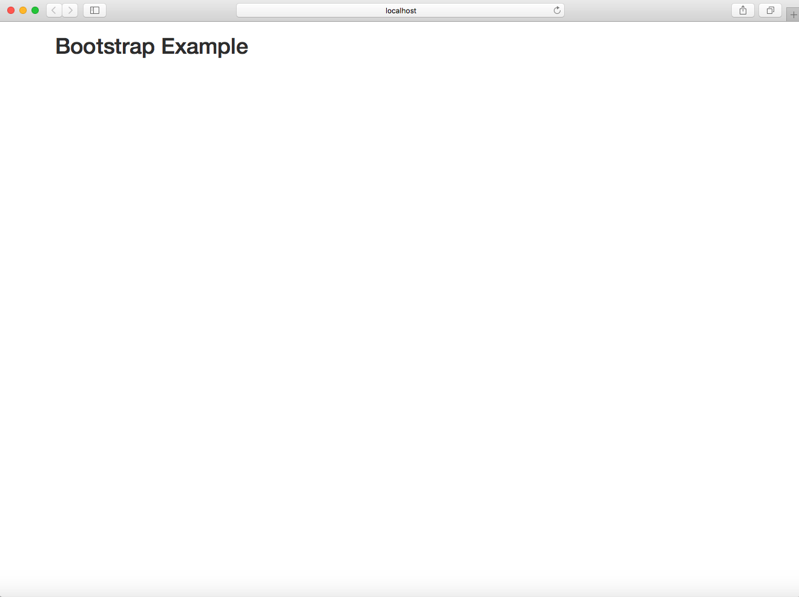

# Bootstrap: Overview

**Zhenguo Chen**

## Introduction

What it says in [Bootstrap website](https://v4-alpha.getbootstrap.com/getting-started/introduction/) is not a brag:

>Bootstrap is the world’s most popular framework for building responsive, mobile-first sites and applications. Inside you’ll find high quality HTML, CSS, and JavaScript to make starting any project easier than ever.

Bootstrap is an open source toolkit developed by Mark Otto and Jacob Thornton at Twitter for building responsive
web. It has lots of prebuilt components and powerful plugins built on jQuery. Before Bootstrap, there were many
libraries used for developing web interface, which brings a hugh amount of burden for websites maintenance. One 
remarkable feature of Bootstrap is its support for [responsive web design](https://en.wikipedia.org/wiki/Responsive_web_design).
That means the layouts of your web apps can adjust dynamically and looks good on **ANY** platform (desktop, tablet,
mobile phone).

## Bootstrap Grid System

Bootstrap builds the layouts using a [grid system](https://getbootstrap.com/docs/4.0/layout/grid/). This grid 
system allows up to 12 columns across the page. You can group the columns together to create a wider column.
The grid system can be [visualized](https://www.w3schools.com/bootstrap/bootstrap_grid_system.asp) as below:


<div class="table-responsive">
<table class="grid" cellspacing="0">
<tbody><tr>
  <td>span 1</td>
  <td>span 1</td>  
  <td>span 1</td>
  <td>span 1</td>
  <td>span 1</td>  
  <td>span 1</td>
  <td>span 1</td>
  <td>span 1</td>  
  <td>span 1</td>
  <td>span 1</td>
  <td>span 1</td>  
  <td>span 1</td>
</tr>
<tr>
  <td colspan="4">&nbsp;span 4</td>
  <td colspan="4">&nbsp;span 4</td>  
  <td colspan="4">&nbsp;span 4</td>
</tr>
<tr>
  <td colspan="4">span 4</td>
  <td colspan="8">span 8</td>  
</tr>
<tr>
  <td colspan="6">span 6</td>
  <td colspan="6">span 6</td>  
</tr>
<tr>
  <td colspan="12">span 12</td>
</tr>
</tbody></table>
</div>

The grid columns should always add up to twelve for a row. Bootstrap grid system provides four classes: xs for
phones, sm for tablets, md for small laptops and lg for laptops and desktops. To present a table of content,
you should create rows which hold columns, then put the content within columns. Here is an example code for
this basic structure which generate 3 columns:

```html
<div class="container">
  <div class="row">
    <div class="col-sm">
      column 1
    </div>
    <div class="col-sm">
      column 2
    </div>
    <div class="col-sm">
      column 3
    </div>
  </div>
</div>
```

<div class="table-responsive">
<table class="grid" cellspacing="0">
<tbody>
<tr>
  <td colspan="4">&nbsp;Column 1</td>
  <td colspan="4">&nbsp;Column 2</td>  
  <td colspan="4">&nbsp;Column 3</td>
</tr>
</tbody></table>
</div>

## How to use Bootstrap

Basically, there are 3 steps to use Bootstrap:

1. Create HTML file since Bootstrap uses HTML elements and CSS properties.
2. Load Boostrap with [CDN](https://en.wikipedia.org/wiki/Content_delivery_network) using
`<link rel="stylesheet" href="https://maxcdn.bootstrapcdn.com/bootstrap/3.3.7/css/bootstrap.min.css">`
and `<script src="https://maxcdn.bootstrapcdn.com/bootstrap/3.3.7/js/bootstrap.min.js"></script>`.
3. Create container to wrap contents using `.container` and `.container-fluid`.

Here is an example which will generate the web page below:
```html
<!DOCTYPE html>
<html lang="en">
<head>
  <title>Bootstrap Example</title>
  <meta charset="utf-8">
  <meta name="viewport" content="width=device-width, initial-scale=1">
  <link rel="stylesheet" href="https://maxcdn.bootstrapcdn.com/bootstrap/3.3.7/css/bootstrap.min.css">
  <script src="https://ajax.googleapis.com/ajax/libs/jquery/3.3.1/jquery.min.js"></script>
  <script src="https://maxcdn.bootstrapcdn.com/bootstrap/3.3.7/js/bootstrap.min.js"></script>
</head>
<body>

<div class="container">
  <h1>Bootstrap Example</h1>
</div>

</body>
</html>
```



third paragraph - how to use bootstrap: write the steps of using bootstrap, give an exmaple of a simple html 
document with CSS and JS links. this apragraph will look like it's long cause you will be giving an example

fourth paragraph - show components of bootstrap, create a simple form using bootstrap, check out the exmaple 
here: https://getbootstrap.com/docs/4.0/components/forms/ - you decide for yourself what's the best way to do 
this

conclusion - summarize advantages of bootstrap, say it's a good boilerplate for web deisgners to start with, 
bootstrap is good for develoeprs who just want a presentable website that can be built in an hour. then give 
links to bootstrap reousces