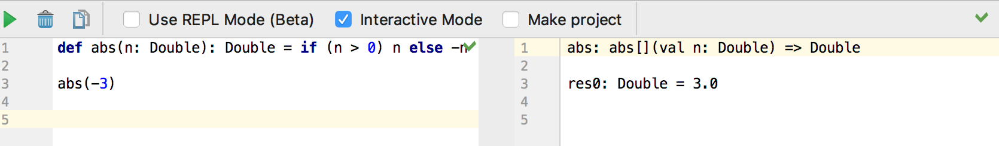
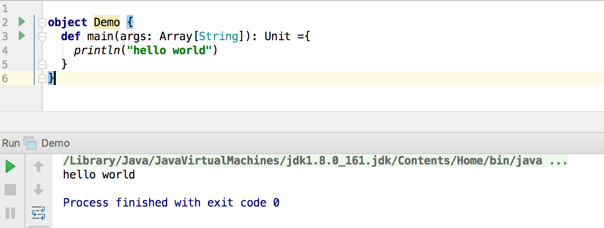

# Scala: Overview

**Zhenguo Chen**

<hr>

Scala is a programming language developed by the programming methods laboratory at EPFL, 
which provide support for **functional programing**. Scala source codes are compiled to Java
byte code and the executable runs on **Java virtual machine**, which means it can seamlessly
interact with Java code. Scala and Java share some things in common, such as basic operations
and object-oriented. However, they are also different in many ways. For instance, Scala uses
`var id: Int = 1` for definition while Java use `Integer id = 1;`. Also, **for Scala, every 
function returns a value**. Without `return` expression, scala will use the evaluation of its 
last expression as return value.

In Scala, every value is an object and every operation is a method call. It does't have primitive
types like int, and char in Java. It only have Int and String instead. What makes Scala most
different from other programming language is its support for functional programming which is a
process of developing software by using ***pure functions**.

As described in [Principles and Practice in Programming Language](http://csci3155.cs.colorado.edu/s18/csci3155-notes.pdf):

> For imperative languages, programs, and constructs, we speak of statement execution that
> modifies a memory or data store. For functional languages, programs, and constructs, we
> thinks of expression evaluation that reduces to the value or terminal result.

In this essay, I will introduce some basic scala syntax by by comparing with Java. In Intellij,
you can use **Scala class** and **Scala worksheet**. Scala worksheet is the same as Scala
Interpreter, but runs inside Intellij where you can easily and quickly evaluate some expressions:



Scala class is more like Java:



As you may notice, in Scala, we use `id: type` rather than `type id;`. To define an array
in Scala, we use `args: Array[String]`. And after every definition of a function, we specify
the return type for this function. Here is a comparison with Java:


```
// Scala
object Demo {
  def main(args: Array[String]): Unit ={
    println("hello world")
  }
}

// Java
public class HelloWorld{
  public static void main(String[] args){
    System.out.println("Hello World!");
  }
}
```

To better understand Scala function, here is an example on abs function which compute the
absolute value of input integer:

```
// Scala
def abs(n: Double): Double = if (n > 0) n else -n

// Java
Integer abs(Integer n){
    if(n > 0)
        return n;
    else
        return -n;
}
```

Since Scala uses the evaluation result of the last expression as return value, we do not need
to explicitly use `return`. Scala also have a powerful pattern matching expression which is
equivalent to `switch` and `case` statement in Java. Here is a comparison of writing factorial
function in Java and Scala:

```
// Scala
def factorial(n: Int): Int = {
  require(n >= 0)
  n match {
    case 0 => 1
    case _ => factorial(n-1)*n
  }
}

// Java
Integer factorial(Integer n){
    switch(n){
        case 0:
            return 1;
        default:
            return factorial(n-1)*n;
    }
}
```

In the `match` expression, if `n` is 0, it returns 1. We use the wildcard `_` to match everything
else. The `require` expression will restrict the value for parameter `n` so that when we pass
a negative value to `factorial`, our function will throw an exception.

You can also do more complicated pattern matching with `match`. If we want to classify a input
value as positive, negative and 0, we will need to match based on the range of input value as
following example:

```
def classifer(n: Int): String = n match {
  case 0 => "zero"
  case x if x > 0 => "positive"
  case _ => "negative"
}
```

The above is an overview and introduction of Scala. It is a interesting programming language. I
hope everyone of you can have fun learning Scala and functional programming!