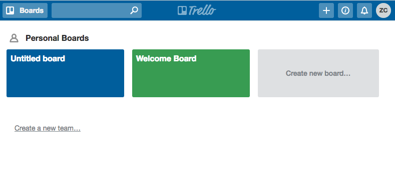
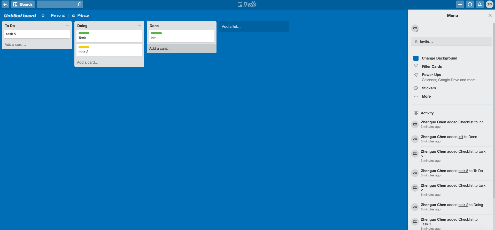
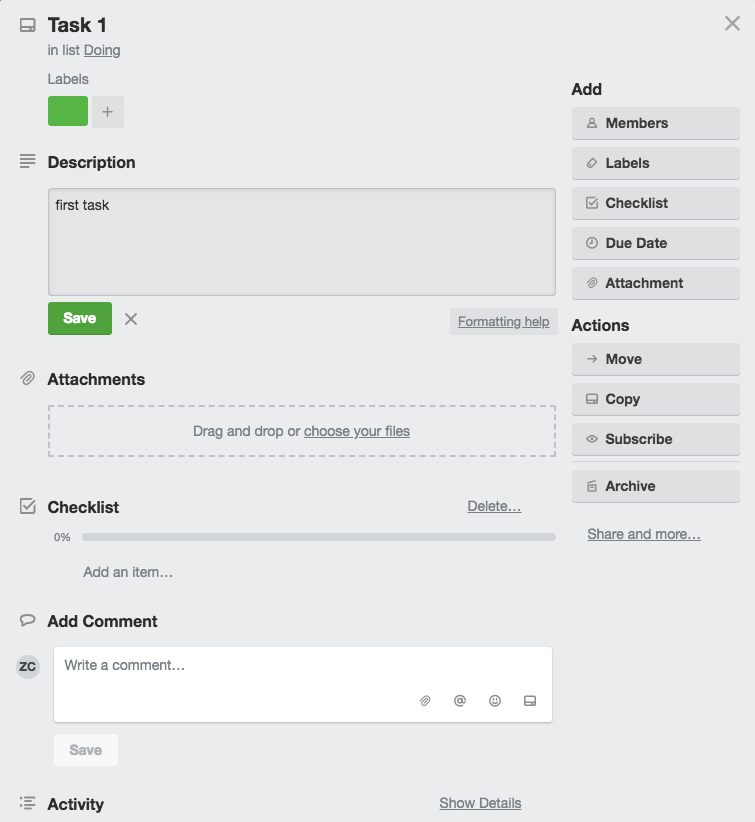
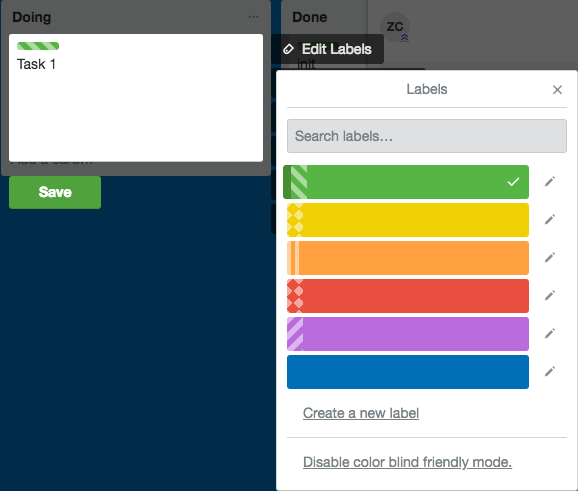

# Trello: Overview

**Zhenguo Chen**

## Introduction

Trello is a popular web-based project management application created in 2011 by [Fog Creek Software](https://en.wikipedia.org/wiki/Fog_Creek_Software).
Since its release, it is named one of the 7 coolest startups by [Wired Magazine](https://en.wikipedia.org/wiki/Wired_(magazine)).
Trello provides various work and personal uses, such as software project management, real
estate management and so on. It is not only easy and convenient to use, but also adaptive to
projects of different sizes in different industries. Trello has gained millions of users over
the past 7 years which makes it one of the most popular project management tool in the world.

## How to Use Trello

After you [sign up](www.trello.com) for an Trello account, you will be lead to the page below:

As you can see in this page, Trello allows you to create your own *board* for you project.
So, what exactly is a Trello board? As explained by Trello itself:

> A Trello board is a series of lists, with a bunch of cards attached.

A basic Trello setup consists of the following three components:

1. Boards. 
2. Lists. By default, there are three types of lists in a board, "To Do", "Doing", and "Done".
3. Cards. A card can represent a task you need to do, or a task you are doing now, or a task
you have done, depending on which list it is attached to.

You can add a list by simply clicking on the `Add a list...`. The most impressive thing about
Trello is its cards. Trello allows you to create cards with detailed description, such as
adding attachments, creating checklists and adding comments.

You can edit cards any time you want to update information about your tasks. You can
also add labels to your cards. There is also a `color blind friendly mode` option for those
who have color blind problem.

# Features

1. Checklist. Inside a card, you can create a checklist to break down a task into smaller steps
which can help you organize a task in more details.
2. Labels. You can give your card multiple labels and use a filter to display cards with certain
label.
3. Attachments. You can add screenshots, PDFs and other documents to a card. And when you click
on the attachment, it will open inside Trello without downloading to your computer.
4. Shortcuts. Trello allows you to use shortcuts to make you work more efficiently.
5. Due dates. You can set due dates for your cards, and subscribe to receive notifications.
6. Access restrictions. You can add access restrictions to your boards. You can also share 
your board with your teammates.
7. Email. You can even have a unique email-address for each board to store all emails sent to
each board.

There are also many other features that may be helpful for your project management. You can even
try this with our course project. Hope you have fun using Trello.

# Resources

* [Trello](https://trello.com)
* [Trello Basic Training Tutorial for Managing Projects and Tasks](https://trello.com/c/z43l3UVd/20-youtube-%E2%9E%9C-trello-basic-training-tutorial-for-managing-projects-and-tasks)
* [How to Organize Your Entire Life with Trello](https://lifehacker.com/how-to-use-trello-to-organize-your-entire-life-1683821040)
