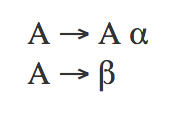
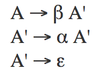

# Recursive Descent Parser

**Zhenguo Chen**

## Introduction

A parser is an important module in an interpreter or compiler which parse a sequence of tokens and find the derivation for this sequence of tokens to generate a parser tree (also known as [syntax tree](https://en.wikipedia.org/wiki/Abstract_syntax_tree)). To put it in another way, parsing is the problem of taking a string of [terminal](https://en.wikipedia.org/wiki/Terminal_and_nonterminal_symbols) symbols and finding a derivation for that string of symbols in a contaxt-free grammar. Parsing is an area with numerous more efficient algorithms, useful tools, and interesting techniques, as well as elegant theory. A recursive descent parser works top-down in the grammar and left-to-right in the input string.

## Requirement for Recursive Descent Parser

The one key requirement for recursive descent parsing to work is that the grammar must not contain [left recursion](https://en.wikipedia.org/wiki/Left_recursion). Otherwise, the parser will go into an infinite loop. Therefore, the first step to implement a recursive descent parser is to make sure the grammar does not contain left recursion. If the grammar is left recursive, we should apply some rules to eliminate left recursion. Here is a simple technique for eliminating left recursion:

Given a grammar with left recursion like the following:



the `A` here is the non-terminal, `alpha` and `beta` are the terminals. we can rewrite the rule to eliminate the left recursion:



Note that we eliminate the left recursion by adding one more non-terminal (`A prime`) and one more terminal (`epsilon`). With the help of these extra terminal and non-terminal, we will be able to make the grammar right recursive. Then, we can start implement our recursive descent parser.

## Implementation

The basic pattern is to write a recursive function for each non-terminal in the grammar. Each parsing function tries to parse characters from the input string by applying each production for that non-terminal in sequence. If applying a production fails, then ir backtracks and tries the next one.  Apply a production means:

1. consumeing characters from the left o the string to match a terminal or
2. calling the function corresponding to a non-terminal to try to match that non-terminal.

Now, let's consider the following grammar and try to implement an recursive parser.

* s: ID ':=' expr
* expr: expr '+' NUM
* expr: expr '-' NUM
* expr: NUM

The grammar above defines the `+` and `-` operation for `NUM` (number). This grammar will allow statement like `a := 1+2-3`. Notice that the rules for `expr` (expression) is left recursive, we need to eliminate the left recursion before we start implementing the recursive descent parser. Here, we applied the technique we stated in the last section, and got the following grammar.

* s: ID ':=' expr
* expr: NUM exprRest
* exprRest: '+' NUM exprRest
* exprRest: '-' NUM exprRest
* exprRest: epsilon (empty)

After eliminate the left recursion, our pseudo code for our parser will look like this:

```
s() {
  match(ID); match(':='); expr();
}

expr() {
  match(NUM); exprRest();
}

exprRest() {
  if (tok == '+') { /* rule 3 */
    match('+'); match(NUM); exprRest();
  }
  else if (tok == '-') { /* rule 4 */
    match('-'); match(NUM); exprRest();
  }
  else { /* rule 5 */
  }
}
```

The `match()` function here is used to check if the current token `cur` matches with its argument or not.

```
match(Token t) {
  if (cur == t) {
    cur = nextToken();
  }
  else {
    error():
  }
}
```

Given more complicated grammar, we only need to follow these two steps, then we will be able to implement our parser easily. After we implement our parser, we can start implementing our own interpreter (even an interpreter for JavaScript!).

## References:

* [Introduction to Recursive Descent Parsing](http://ag-kastens.uni-paderborn.de/lehre/material/compiler/parsdemo/recintro.html)
* [Writing a Simple Recursive Descent Parser](http://weblog.jamisbuck.org/2015/7/30/writing-a-simple-recursive-descent-parser.html)
